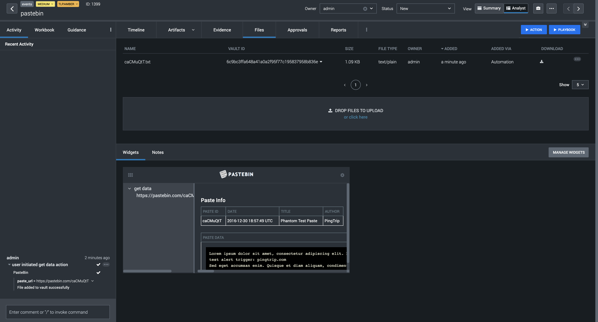

[comment]: # "Auto-generated SOAR connector documentation"
# PasteBin

Publisher: Splunk  
Connector Version: 2.0.2  
Product Vendor: PasteBin  
Product Name: PasteBin  
Product Version Supported (regex): ".\*"  
Minimum Product Version: 5.3.3  

This app integrates with PasteBin to perform investigative and generic actions

[comment]: # " File: README.md"
[comment]: # ""
[comment]: # "  Copyright (c) 2019-2023 Splunk Inc."
[comment]: # ""
[comment]: # "  Licensed under the Apache License, Version 2.0 (the 'License');"
[comment]: # "  you may not use this file except in compliance with the License."
[comment]: # "  You may obtain a copy of the License at"
[comment]: # ""
[comment]: # "      http://www.apache.org/licenses/LICENSE-2.0"
[comment]: # ""
[comment]: # "  Unless required by applicable law or agreed to in writing, software distributed under"
[comment]: # "  the License is distributed on an 'AS IS' BASIS, WITHOUT WARRANTIES OR CONDITIONS OF ANY KIND,"
[comment]: # "  either express or implied. See the License for the specific language governing permissions"
[comment]: # "  and limitations under the License."
[comment]: # ""
## Port Details

The app uses HTTP/ HTTPS protocol for communicating with the PasteBin server. Below are the default
ports used by the Splunk SOAR Connector.

| SERVICE NAME | TRANSPORT PROTOCOL | PORT |
|--------------|--------------------|------|
| http         | tcp                | 80   |
| https        | tcp                | 443  |

## Steps to Configure the PasteBin Splunk SOAR app's asset

Follow these steps to configure the PasteBin Splunk SOAR app's asset:

-   Log in to the PasteBin platform.

      

    -   Once logged in, select **API** by clicking it from the navigation bar.
    -   In the Developers API section, click on **Your Unique Developer API Key** .
    -   Copy the generated Developers API Key.
    -   NOTE: Whenever you log in, the generated API key will always be available
        [here](https://pastebin.com/doc_api) .

-   Now, Log in to your Splunk SOAR instance.

      

    -   Navigate to the **Home** dropdown and select **Apps** .
    -   Search the PasteBin App from the search box.
    -   Click on the **CONFIGURE NEW ASSET** button.
    -   Navigate to the **Asset Info** tab and enter the Asset name and Asset description.
    -   Navigate to the **Asset Settings** .
    -   Paste the generated **API Key** from PasteBin UI to its respective configuration parameter.
    -   Pastebin username and password are optional parameters. To create any paste as user, you
        need to provide credentials for the same.
    -   Save the asset.
    -   Now, test the connectivity of the Splunk SOAR server to the PasteBin instance by clicking
        the **TEST CONNECTIVITY** button.

## Explanation of the Asset Configuration Parameters

The asset configuration parameters affect 'test connectivity' and some other actions of the
application. The parameters related to test connectivity action are API Key, Pastebin username, and
Pastebin password.

-   **Pastebin api dev key (Required):** API Token for asset authorization.
-   **Pastebin username (Optional):** The username of your PasteBin account.
-   **Pastebin password (Optional):** The password of your PasteBin account.
-   NOTE: The developer API key, username, and password, all must belong to one particular account
    to create paste as a user.

## Explanation of the PasteBin Actions' Parameters

-   ### Test Connectivity (Action Workflow Details)

    -   This action will test the connectivity of the Splunk SOAR server to the PasteBin instance by
        making an initial API call using the provided asset configuration parameters.
    -   The action validates the provided asset configuration parameters. Based on the API call
        response, the appropriate success and failure message will be displayed when the action gets
        executed.

-   ### Get Data

    To download, parse, and save a paste from PasteBin, the user can run this action. After a
    successful run of the action, the text file will be generated with paste data and stored in the
    vault.  
      
      

    -   **Action Parameter** : Pastebin URL

          
        This is a required parameter. The user can enter any Pastebin URL to fetch its details. On
        running the action, it generates a custom view listing paste details like author, created
        time, title, paste data, etc. Fetching details for the 'Private as user' paste is not
        supported by this action.  

    -   **NOTE:** While creating a paste from the PasteBin platform where we have set the paste
        format (syntax highlighting) in Bash, C, C#, C++, CSS, HTML, JSON, Java, JavaScript, Lua,
        Objective C, PHP, Perl, Python, Ruby, and Swift, file will be downloading the paste in
        'paste_title.file_extension' format if title is provided else it will be downloaded in
        'paste_id.file_extension' format. For all the other syntax highlighting, the file will be
        downloaded in 'paste_title.txt' format if title is provided, else it will be downloaded in
        'paste_id.txt' format.  
        While running the 'get_data' action, all the paste_format (syntax highlighting) which have
        been selected will be stored in the 'paste_id.txt' format

-   ### Create Paste

    This action lets a user create a paste from pastebin.

    -   **Action Parameter: Paste text**

          

        -   This is a required parameter. It is the text that will be written inside your paste.

    -   **Action Parameter: Paste title**

          

        -   This is an optional parameter. It will be the name/title of your paste.

    -   **Action Parameter: Paste format**

          

        -   This is an optional parameter. It will be the syntax highlighting value. This parameter
            supports more than 200 types of syntax highlighting options like Python, C, SQL, etc.

    -   **Action Parameter: Paste exposure**

          

        -   This is an optional parameter. It will set the exposure of a paste by making it a
            public, unlisted, or private paste.

    -   **Action Parameter: Paste expiration**

          

        -   This is an optional parameter. It will set the expiration date of any paste according to
            the choice of the user.

    -   **Action Parameter: Paste as user**

          

        -   This is an optional parameter. The paste will be pasted as 'User' (Pastebin username) if
            this parameter is marked check, else it will be pasted as 'Guest'. Creating a 'Private
            as user' paste is not supported by this action.

### Configuration Variables
The below configuration variables are required for this Connector to operate.  These variables are specified when configuring a PasteBin asset in SOAR.

VARIABLE | REQUIRED | TYPE | DESCRIPTION
-------- | -------- | ---- | -----------
**api_dev_key** |  required  | password | API dev key
**pastebin_username** |  optional  | string | Username
**pastebin_password** |  optional  | password | Password

### Supported Actions  
[test connectivity](#action-test-connectivity) - Validate the asset configuration for connectivity using the supplied configuration  
[get data](#action-get-data) - Download, parse, and save a paste from PasteBin  
[create paste](#action-create-paste) - Create a paste from PasteBin  

## action: 'test connectivity'
Validate the asset configuration for connectivity using the supplied configuration

Type: **test**  
Read only: **True**

#### Action Parameters
No parameters are required for this action

#### Action Output
No Output  

## action: 'get data'
Download, parse, and save a paste from PasteBin

Type: **investigate**  
Read only: **True**

#### Action Parameters
PARAMETER | REQUIRED | DESCRIPTION | TYPE | CONTAINS
--------- | -------- | ----------- | ---- | --------
**paste_url** |  required  | PasteBin URL to fetch the data | string |  `url` 

#### Action Output
DATA PATH | TYPE | CONTAINS | EXAMPLE VALUES
--------- | ---- | -------- | --------------
action_result.status | string |  |   success  failed 
action_result.parameter.paste_url | string |  `url`  |   https://pastebin.com/caCMuQtT 
action_result.data.\*.author | string |  |   Guest 
action_result.data.\*.creation_time | string |  |   2016-12-30 18:57:49 UTC 
action_result.data.\*.paste_data | string |  |   PasteBin text 
action_result.data.\*.pasteid | string |  |   caCMuQtT 
action_result.data.\*.title | string |  |   Phantom Test Paste 
action_result.data.\*.vault_id | string |  |   8f34774262c4bcda0b2161f0ba34af8e80aa1bd9 
action_result.summary | string |  |  
action_result.message | string |  |   File added successfully to vault 
summary.total_objects | numeric |  |   1 
summary.total_objects_successful | numeric |  |   1   

## action: 'create paste'
Create a paste from PasteBin

Type: **generic**  
Read only: **False**

#### Action Parameters
PARAMETER | REQUIRED | DESCRIPTION | TYPE | CONTAINS
--------- | -------- | ----------- | ---- | --------
**paste_text** |  required  | PasteBin text to paste | string | 
**paste_title** |  optional  | PasteBin title to paste | string | 
**paste_format** |  optional  | PasteBin format to paste | string | 
**paste_exposure** |  optional  | PasteBin paste to be marked as public, private, or unlisted | string | 
**paste_expiration** |  optional  | PasteBin paste expiration time | string | 
**paste_as_user** |  optional  | Paste as user | boolean | 

#### Action Output
DATA PATH | TYPE | CONTAINS | EXAMPLE VALUES
--------- | ---- | -------- | --------------
action_result.status | string |  |   success  failed 
action_result.parameter.paste_as_user | boolean |  |   True  False 
action_result.parameter.paste_expiration | string |  |   Never 
action_result.parameter.paste_exposure | string |  |   Public 
action_result.parameter.paste_format | string |  |   Python 
action_result.parameter.paste_text | string |  |   PasteBin text 
action_result.parameter.paste_title | string |  |   PasteBin title 
action_result.data.\*.author | string |  |   Guest 
action_result.data.\*.creation_time | string |  |   2022-07-04 09:25:27 UTC 
action_result.data.\*.paste_data | string |  |   PasteBin text 
action_result.data.\*.pasteid | string |  |   caCMuQtT 
action_result.data.\*.title | string |  |   PasteBin title 
action_result.data.\*.url | string |  `url`  |   https://pastebin.com/caCMuQtT 
action_result.summary | string |  |  
action_result.message | string |  |   Link obtained successfully 
summary.total_objects | numeric |  |   1 
summary.total_objects_successful | numeric |  |   1 